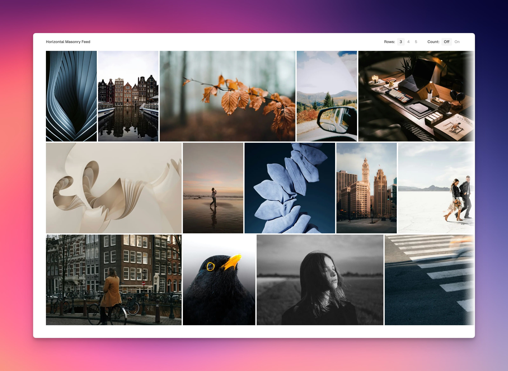

# Horizontal Masonry

A responsive horizontal masonry image gallery built with Next.js 15, React 19, and TypeScript. Features smooth horizontal scrolling, dynamic row layouts, and optimized image loading.



## Features

- **Horizontal Masonry Layout** - Images flow horizontally in a masonry pattern
- **Dynamic Row Configuration** - Toggle between 3, 4, or 5 rows
- **Wheel to Horizontal Scroll** - Vertical mouse wheel events navigate horizontally
- **Deferred Hover Effect** - Images dim after 1-second hover, with instant mode for subsequent hovers
- **Scroll-Aware Interactions** - Hover effects disabled during scrolling for better UX
- **Responsive Design** - Adapts image heights based on viewport
- **Performance Optimized** - Request animation frame throttling and lazy loading
- **Image Count Overlay** - Optional display of image index numbers
- **Edge Fading** - Subtle fade effects at scroll boundaries
- **Blur Placeholders** - Smooth image loading with blur-up effect

## Getting Started

First, install dependencies:

```bash
pnpm install
```

Then run the development server:

```bash
pnpm dev
```

Open [http://localhost:3000](http://localhost:3000) to view the gallery.

## Tech Stack

- **Next.js 15.5.4** - React framework with App Router and Turbopack
- **React 19.1.0** - UI library
- **TypeScript** - Type-safe development
- **Tailwind CSS v4** - Utility-first styling
- **Biome** - Fast linter and formatter

## Available Scripts

```bash
pnpm dev       # Start development server with Turbopack
pnpm build     # Build for production
pnpm start     # Start production server
pnpm lint      # Run linting and auto-fix issues
pnpm format    # Format code with Biome
```

## Project Structure

```
/app              # Next.js App Router
  ├── page.tsx    # Main gallery page
  ├── layout.tsx  # Root layout
  └── globals.css # Global styles with Tailwind
/components       # React components
  ├── horizontal-masonry.tsx  # Main gallery component
  ├── image-card.tsx          # Individual image card with hover effects
  ├── toggle-group.tsx        # Row/count toggle controls
  └── select.tsx              # Select component
/hooks            # Custom React hooks
  ├── use-deferred-hover-effect.ts       # Deferred hover with scroll detection
  └── use-wheel-to-horizontal-scroll.ts  # Wheel event conversion
/data             # Data files
  └── images.ts   # Image metadata with blur placeholders
/lib              # Utilities
  └── utils.ts    # Helper functions (cn, etc.)
```

## Deployment

Deploy easily on [Vercel](https://vercel.com/new?utm_medium=default-template&filter=next.js&utm_source=create-next-app&utm_campaign=create-next-app-readme) or any platform that supports Next.js applications.
